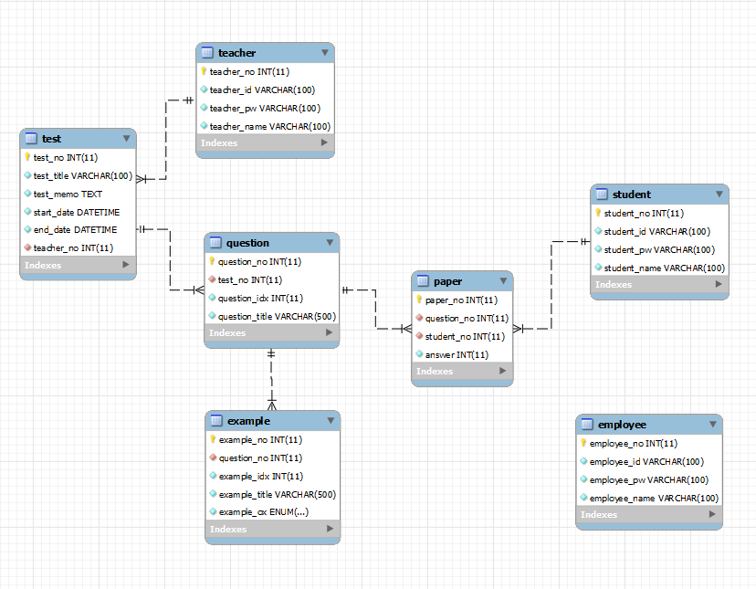

# Spring Boot 온라인 시험 프로젝트

#프로젝트 소개
---
Spring MVC을 학습하고 개발한 미니 프로젝트.
Spring MVC, filter, REST와 Ajax 등을 공부하며 적용해본 프로젝트이다.

기본적으로 사이트 관리자가 있고, 강사는 시험을 등록할 수 있으며
등록된 시험은 설정값에 따라 자동으로 시험 시작 및 마감이 된다. 
학생들은 시험 시간에 맞춰 시험을 응시, 제출하며 자동으로 점수가 계산되어 확인할 수 있다.
  

주요 개발 환경  
---
</a>&nbsp;
</a>&nbsp;
</a>&nbsp;
</a>&nbsp;
</a>&nbsp;
</a>&nbsp;
- `개발 도구 : eclipse sts 4.17`
- `자바 버전 : 11`
- `데이터 베이스 : MariaDB`
- `빌드 플러그인 : maven`
- `MyBatis`
- `Lombok`
  

주요 기능
---
- 관리자 
  - 사이트의 가입자/시험 현황 차트 등 정보 확인 가능
  - 직원, 강사, 학생 등록/삭제
  - 비밀번호 수정
 
- 강사
  - 시험 설정 및 문제(객관식) 등록
  - 시험 및 문제 수정, 삭제
  - 로그인
  - 비밀번호 수정

- 학생
  - OAuth 소셜 로그인
  - 시험 응시
  - 답안 제출
  - 점수 확인
  - 로그인
  - 비밀번호 수정
  

ERD
---

